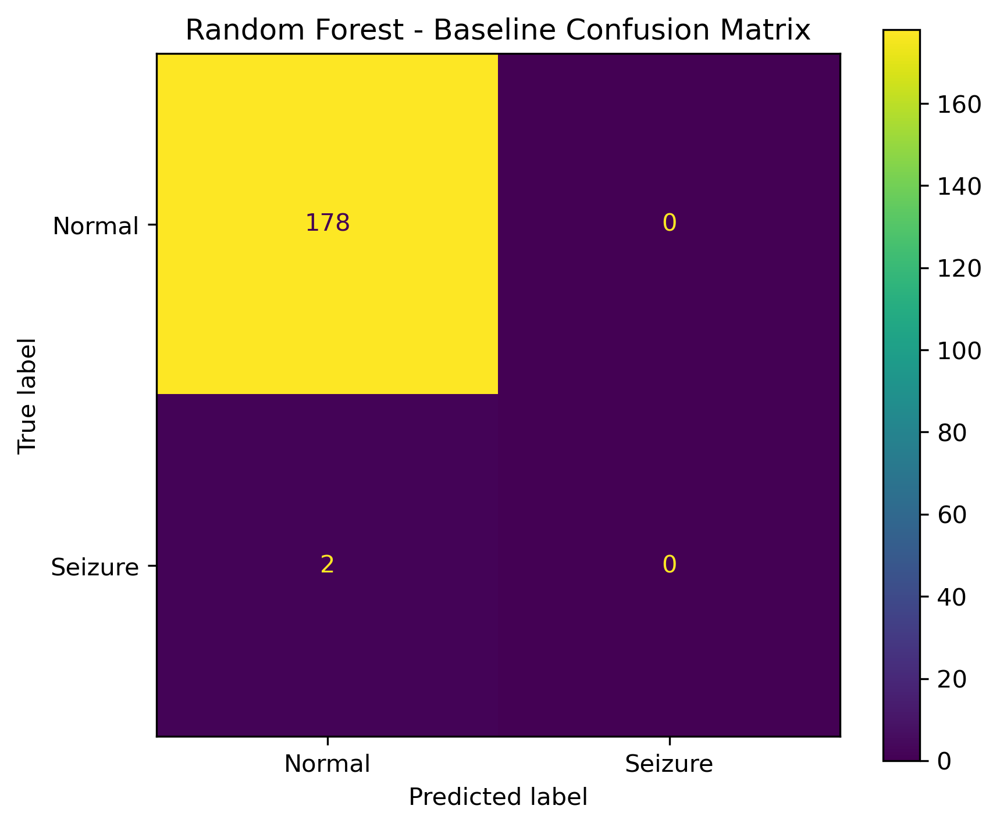

# EEG-Based Epileptic Seizure Detection Using Signal Processing and Machine Learning

**Author:** Shivam Prajapati
**Computer Science Engineering — Artificial Intelligence & Machine Learning**

---

## 1. Project Overview

Epileptic seizures are neurological events that can produce abnormal patterns in Electroencephalography (EEG) signals. Automatic seizure detection from EEG recordings is an important application of biomedical signal processing and machine learning.

This project presents an end-to-end machine learning pipeline for detecting epileptic seizure activity from EEG signals using the **CHB-MIT Scalp EEG Database**.

The system processes raw EEG recordings, performs signal preprocessing, segments continuous EEG signals into fixed-length windows, assigns seizure and non-seizure labels, extracts statistical and frequency-domain features, and applies a Random Forest classifier for binary classification.

The project also evaluates the effect of severe class imbalance and investigates classification threshold adjustment to understand the trade-off between seizure sensitivity and false-positive predictions.

### Complete Pipeline

* EEG data loading from EDF files
* EEG signal preprocessing
* Fixed-length EEG windowing
* Seizure and non-seizure labeling
* Statistical feature extraction
* Frequency-domain feature extraction
* Machine learning dataset construction
* Random Forest model training
* Model evaluation
* Classification threshold analysis
* EEG window-level prediction
* Automated evaluation result generation
* Result visualization and reporting

This project was developed as a research and learning prototype to gain practical experience in:

* Biomedical signal processing
* EEG data analysis
* Feature engineering
* Machine learning
* Imbalanced classification
* Model evaluation
* Reproducible machine learning workflows

---

## 2. Objectives

The main objectives of this project are:

* Load EEG recordings from EDF files.
* Understand EEG signal properties and metadata.
* Preprocess EEG signals using frequency filtering.
* Segment continuous EEG recordings into fixed-length windows.
* Identify seizure and non-seizure EEG windows.
* Extract statistical features from EEG signals.
* Extract frequency-domain features using Power Spectral Density (PSD).
* Construct a machine learning feature dataset.
* Train a Random Forest classifier.
* Evaluate model performance using appropriate classification metrics.
* Analyze the effect of severe class imbalance.
* Investigate classification threshold adjustment.
* Perform prediction on individual EEG windows.
* Generate reproducible evaluation results and visualizations.

---

## 3. Dataset

This project uses the **CHB-MIT Scalp EEG Database**, a publicly available EEG dataset containing EEG recordings from pediatric subjects with intractable seizures.

The EEG recordings are provided in **EDF (European Data Format)** files and are processed using the **MNE-Python** library.

The current project focuses on EEG recordings from the CHB-MIT dataset, including analysis of:

```text
chb01_03.edf
```

The raw EDF recordings are not included in this repository because of their large file size. They should be downloaded separately from the CHB-MIT Scalp EEG Database and placed locally inside the appropriate data directory.

---

## 4. Project Workflow

The complete EEG processing and machine learning workflow is:

```text
Raw EEG EDF Files
        │
        ▼
EEG Data Loading using MNE
        │
        ▼
EEG Signal Understanding
        │
        ▼
Signal Preprocessing
        │
        ▼
4-Second EEG Windowing
        │
        ▼
Seizure / Non-Seizure Labeling
        │
        ▼
Feature Extraction
        │
        ├─────────────────────────┐
        ▼                         ▼
Statistical Features      Frequency-Domain Features
        │                         │
        └────────────┬────────────┘
                     ▼
          Machine Learning Dataset
                     │
                     ▼
          Random Forest Classifier
                     │
                     ▼
              Model Evaluation
                     │
                     ▼
          Classification Threshold
                 Analysis
                     │
                     ▼
            EEG Window Prediction
                     │
                     ▼
          Results and Visualization
```

---

## 5. EEG Signal Preprocessing

The raw EEG signals are loaded from EDF files using the **MNE-Python** library.

A band-pass filter is applied to retain relevant EEG frequency components and reduce unwanted low-frequency drift and high-frequency noise.

The filtering range used in the current pipeline is:

| Parameter             | Value  |
| --------------------- | ------ |
| Low Cutoff Frequency  | 0.5 Hz |
| High Cutoff Frequency | 40 Hz  |

The preprocessing step prepares the EEG signals for subsequent windowing and feature extraction.

---

## 6. EEG Windowing

The continuous EEG recordings are divided into fixed-length windows.

The current pipeline uses:

| Parameter          | Value     |
| ------------------ | --------- |
| Sampling Frequency | 256 Hz    |
| Window Duration    | 4 seconds |
| Samples per Window | 1024      |

Each EEG window contains:

```text
23 EEG Channels × 1024 Samples
```

The fixed-length EEG windows are treated as individual samples for feature extraction and machine learning.

This approach converts the continuous EEG recording into smaller segments that can be independently analyzed and classified.

---

## 7. Seizure Labeling

Each EEG window is assigned a binary classification label:

```text
0 → Normal / Non-Seizure
1 → Seizure
```

Seizure annotations associated with the EEG recordings are used to identify windows that overlap with seizure activity.

For the current dataset construction experiment:

| Category        | Count |
| --------------- | ----: |
| Total Windows   |   900 |
| Normal Windows  |   890 |
| Seizure Windows |    10 |

The resulting dataset contains a severe class imbalance between normal and seizure samples.

This class imbalance is an important factor when evaluating the performance of the machine learning model.

---

## 8. Feature Extraction

Features are extracted from each EEG window using statistical and frequency-domain analysis.

The current feature dataset contains eight features for each EEG window.

### 8.1 Statistical Features

The following statistical features are extracted from the EEG signals:

* Mean
* Standard Deviation
* Variance

These features are calculated from the EEG channels and aggregated to produce window-level statistical representations.

### 8.2 Frequency-Domain Features

Power Spectral Density (PSD) is calculated using the **Welch method**.

The following EEG frequency bands are analyzed:

| Frequency Band | Frequency Range |
| -------------- | --------------- |
| Delta          | 0.5–4 Hz        |
| Theta          | 4–8 Hz          |
| Alpha          | 8–13 Hz         |
| Beta           | 13–30 Hz        |
| Gamma          | 30–40 Hz        |

The final feature vector for each EEG window contains:

```text
Mean
Std
Variance
Delta
Theta
Alpha
Beta
Gamma
```

The resulting dataset has the following dimensions:

```text
Features Shape = (900, 8)
Labels Shape   = (900,)
```

The processed feature data is stored in the `data/` directory.

---

## 9. Machine Learning Model

A **Random Forest Classifier** is used as the baseline machine learning model.

Random Forest was selected because it:

* Works effectively with tabular feature data.
* Can model nonlinear relationships.
* Does not require extensive feature scaling.
* Provides feature importance information.
* Is relatively straightforward to train and interpret.

The trained Random Forest model is saved as:

```text
models/random_forest_model.pkl
```

The model is later loaded for evaluation and individual EEG window prediction.

The current Random Forest implementation is considered a **baseline research model** and is not a clinically validated seizure detection system.

---

## 10. Model Evaluation

The dataset is divided into training and testing subsets using an 80/20 split.

The resulting dataset contains:

| Dataset          | Samples |
| ---------------- | ------: |
| Total Samples    |     900 |
| Training Samples |     720 |
| Testing Samples  |     180 |

The class distribution in the test set is:

| Class           | Samples |
| --------------- | ------: |
| Normal Samples  |     178 |
| Seizure Samples |       2 |

The model is evaluated using the following metrics:

* Accuracy
* Precision
* Sensitivity (Recall)
* Specificity
* F1-Score
* Balanced Accuracy
* Confusion Matrix
* Classification Report

Because the dataset is severely imbalanced, accuracy alone is not considered sufficient for evaluating seizure detection performance.

---

## 11. Baseline Model Results

The Random Forest model was initially evaluated using the default classification threshold:

```text
Threshold = 0.50

## 12. Classification Threshold Analysis

The predicted seizure probabilities were further analyzed by changing the classification threshold.

The following thresholds were evaluated:

```text
0.50
0.20
0.10
0.05
0.01
```

The results were:

| Threshold | Sensitivity | Specificity |
| --------- | ----------: | ----------: |
| 0.50      |       0.00% |     100.00% |
| 0.20      |       0.00% |     100.00% |
| 0.10      |       0.00% |      96.07% |
| 0.05      |      50.00% |      87.64% |
| 0.01      |      50.00% |      63.48% |

At a classification threshold of **0.05**, the confusion matrix was:

|                    | Predicted Normal | Predicted Seizure |
| ------------------ | ---------------: | ----------------: |
| **Actual Normal**  |              156 |                22 |
| **Actual Seizure** |                1 |                 1 |

At this threshold:

```text
Total Seizure Samples = 2
Detected Seizures     = 1
Sensitivity           = 50.00%
```

However:

```text
False Positives = 22
Specificity     = 87.64%
```

This demonstrates the trade-off between increasing seizure sensitivity and increasing false-positive predictions.

The threshold analysis results are saved in:

```text
results/threshold_analysis.png
```

The threshold analysis is exploratory because the test set contains only two seizure samples. Therefore, these results should not be considered statistically reliable threshold optimization.

## 12.5 Results and Visualizations

The following visualizations summarize the performance of the Random Forest model, including the baseline evaluation and the final threshold-optimized results.

### Baseline Confusion Matrix

The baseline model uses the default classification threshold of 0.50. In the initial baseline evaluation, the model failed to detect seizure samples despite achieving high overall accuracy, demonstrating the impact of class imbalance on seizure detection performance.



### Threshold Optimization

The classification threshold was evaluated at multiple operating points to study the trade-off between seizure detection sensitivity and false-positive rate.

The final operating threshold was selected as:

```text
Threshold = 0.40
## 12.5 Results and Visualizations

The following visualizations summarize the performance of the Random Forest model, including the baseline evaluation and the final threshold-optimized results.

### Baseline Confusion Matrix

The baseline model uses the default classification threshold of 0.50. In the initial baseline evaluation, the model failed to detect seizure samples despite achieving high overall accuracy, demonstrating the impact of class imbalance on seizure detection performance.


### Threshold Optimization

The classification threshold was evaluated at multiple operating points to study the trade-off between seizure detection sensitivity and false-positive rate.

The final operating threshold was selected as:

```text
Threshold = 0.40
## 13. Key Findings

The main findings of the current experiment are:

* The baseline Random Forest model achieved 98.89% accuracy at the default threshold.
* The high accuracy was strongly influenced by severe class imbalance.
* The baseline model failed to detect seizure samples at the default threshold.
* Baseline sensitivity was 0%.
* Baseline balanced accuracy was 50%.
* Lowering the classification threshold to 0.05 increased sensitivity to 50% on the current test split.
* The improved sensitivity resulted in additional false-positive predictions.
* Specificity decreased from 100% to 87.64% at the 0.05 threshold.
* The model demonstrates the difficulty of seizure detection when only a small number of seizure examples are available.
* Accuracy alone is not an appropriate measure of success for this highly imbalanced classification problem.

The current model is therefore best considered a **baseline research prototype** demonstrating an end-to-end EEG signal processing and machine learning workflow.

---

## 14. Prediction Analysis

The trained Random Forest model was also tested on individual EEG windows.

A normal EEG window was classified as:

```text
Normal / Non-Seizure
```

Known seizure windows from the analyzed recording were also evaluated individually.

For the known seizure windows:

| Parameter             | Result  |
| --------------------- | ------- |
| Window Range          | 749–758 |
| Total Seizure Windows | 10      |
| Detected as Seizure   | 0       |
| Detected as Normal    | 10      |

This indicates that the current Random Forest model failed to detect the known seizure windows in the analyzed recording.

This result further demonstrates the limitations of the current baseline model and highlights the impact of:

* Severe class imbalance
* Limited seizure samples
* Limited feature representation
* Limited training data
* Potential differences between EEG recordings

The prediction pipeline is therefore useful for demonstrating the current model's behavior and identifying areas requiring further research.

---

## 15. Feature Importance

The Random Forest model provides feature importance estimates that indicate the relative contribution of the extracted features to the model's predictions.

The current feature set contains:

```text
Mean
Std
Variance
Delta
Theta
Alpha
Beta
Gamma
```

The feature importance visualization is saved in:

```text
results/feature_importance.png
```

The feature importance analysis provides an initial interpretation of which signal characteristics contribute to the baseline model.

However, feature importance should not be interpreted as evidence that any particular EEG frequency band is clinically diagnostic of seizures.

---

## 16. Limitations

### 16.1 Severe Class Imbalance

The current dataset contains substantially more normal EEG windows than seizure windows.

```text
Normal Windows  = 890
Seizure Windows = 10
```

This imbalance makes it difficult for the model to learn robust seizure-specific patterns.

### 16.2 Limited Seizure Samples

Only a small number of seizure windows are available in the current experiment.

The test set contains only two seizure samples, making sensitivity estimates highly unstable.

A single additional correct or incorrect seizure prediction can significantly change the measured sensitivity.

### 16.3 Limited Dataset Scope

The current experiment uses a limited subset of the CHB-MIT dataset.

The model has not yet been extensively evaluated across multiple patients.

### 16.4 Patient-Independent Generalization

The current experiment does not provide sufficient evidence that the model will generalize to completely unseen patients.

Patient-independent evaluation is required before making stronger claims about generalization.

### 16.5 Threshold Analysis Limitations

The threshold analysis is based on a very small test set containing only two seizure samples.

Therefore, the threshold results are exploratory and should not be considered statistically reliable threshold optimization.

### 16.6 No Clinical Validation

This project is an educational and research prototype.

The model has not been clinically validated and should not be used for medical diagnosis, treatment, or clinical decision-making.

---

## 17. Future Work

Future improvements may include:

* Using a larger number of EEG recordings.
* Including data from multiple patients.
* Performing patient-independent evaluation.
* Increasing the number of seizure samples.
* Applying appropriate class imbalance handling techniques.
* Exploring class weighting and resampling methods.
* Performing stratified cross-validation.
* Optimizing classification thresholds using a dedicated validation set.
* Evaluating Precision-Recall curves.
* Evaluating ROC-AUC.
* Testing Support Vector Machines (SVM).
* Testing XGBoost and other ensemble methods.
* Exploring 1D CNN-based EEG classification.
* Exploring LSTM and other deep learning approaches.
* Extracting additional time-domain features.
* Extracting additional frequency-domain features.
* Investigating time-frequency representations such as wavelets.
* Evaluating model performance using larger and more balanced test sets.
* Improving seizure detection sensitivity while controlling false-positive rates.
* Evaluating patient-independent and cross-patient performance.
* Investigating subject-specific and generalized seizure detection models.

---

## 18. Technologies Used

The project uses the following technologies and libraries:

* Python
* MNE-Python
* NumPy
* Pandas
* SciPy
* Matplotlib
* Scikit-learn
* Joblib
* Jupyter Notebook

---

## 19. Project Structure

The repository is organized into separate directories for data, notebooks, models, results, visualizations, and source code.

```text
EEG-Seizure-Detection/
│
├── data/
│   ├── features.csv
│   ├── features.npy
│   ├── labels.npy
│   └── README.md
│
├── images/
│   ├── random_forest_baseline_confusion_matrix.png
│   ├── random_forest_confusion_matrix.png
│   └── random_forest_threshold_confusion_matrix.png
│
├── models/
│   └── random_forest_model.pkl
│
├── notebooks/
│   ├── 01_Reading_EEG.ipynb
│   ├── 02_Understanding_EEG.ipynb
│   ├── 03_Preprocessing.ipynb
│   ├── 04_Windowing.ipynb
│   ├── 05_Labeling.ipynb
│   ├── 06_Feature_Extraction.ipynb
│   ├── 07_Model_Training.ipynb
│   ├── 08_Dataset_Builder.ipynb
│   ├── 09_Model_Evaluation.ipynb
│   └── 10_Prediction.ipynb
│
├── results/
│   ├── confusion_matrix.png
│   ├── feature_importance.png
│   ├── final_evaluation.txt
│   └── threshold_analysis.png
│
├── src/
│   └── final_evaluation.py
│
├── .gitignore
├── README.md
└── requirements.txt
```

The raw CHB-MIT EDF recordings and the generated `windows.npy` file are intentionally excluded from the GitHub repository because of their large size.

They should remain available locally for reproducing the full data-processing pipeline.

---

## 20. Installation

### Clone the Repository

```bash
git clone https://github.com/ShivamKumarPrajapati-123/EEG-Seizure-Detection.git
```

### Navigate to the Project Directory

```bash
cd EEG-Seizure-Detection
```

### Install the Required Python Packages

```bash
pip install -r requirements.txt
```

---

## 21. Running the Project

The notebooks are designed to be executed in the following general sequence:

```text
01_Reading_EEG
        ↓
02_Understanding_EEG
        ↓
03_Preprocessing
        ↓
04_Windowing
        ↓
05_Labeling
        ↓
06_Feature_Extraction
        ↓
08_Dataset_Builder
        ↓
07_Model_Training
        ↓
09_Model_Evaluation
        ↓
10_Prediction
```

The notebooks demonstrate the individual stages of the project pipeline.

The final automated evaluation script can be executed from the project root using:

```bash
python src/final_evaluation.py
```

The script generates evaluation outputs and visualizations in the `results/` directory.

---

## 22. Reproducibility

The project uses fixed random seeds where applicable to improve reproducibility of the machine learning experiments.

### Main Processed Artifacts

```text
data/features.csv
data/features.npy
data/labels.npy
models/random_forest_model.pkl
```

### Evaluation Outputs

```text
results/confusion_matrix.png
results/feature_importance.png
results/final_evaluation.txt
results/threshold_analysis.png
```

Raw EEG recordings are not stored in the repository and must be obtained separately from the CHB-MIT Scalp EEG Database.

---

## 23. Research Status

**Status: Research and Development / Baseline Prototype**

The current project demonstrates an end-to-end pipeline for EEG signal processing and machine learning-based seizure classification.

The implemented pipeline covers:

* EEG data loading
* Signal preprocessing
* Window segmentation
* Seizure labeling
* Feature extraction
* Dataset construction
* Machine learning model training
* Model evaluation
* Threshold analysis
* Individual EEG window prediction

The current experimental results highlight the challenges of seizure detection under severe class imbalance.

The baseline model demonstrates high overall accuracy but poor seizure detection sensitivity, emphasizing the importance of appropriate evaluation metrics and robust dataset construction.

Future development will focus on improving seizure detection sensitivity, increasing the amount of seizure data, performing patient-independent evaluation, and investigating more robust machine learning and deep learning approaches.

---

## 24. Disclaimer

This project is developed for **educational and research purposes only**.

The current model is **not a clinically validated medical device** and should not be used for medical diagnosis, treatment, or clinical decision-making.

The reported results are based on a limited experimental dataset and should not be interpreted as evidence of clinical effectiveness.

---

## 25. Author

**Shivam Prajapati**

Computer Science Engineering — Artificial Intelligence & Machine Learning

**GitHub:**
https://github.com/ShivamKumarPrajapati-123
---

## 13. Event-Level Validation

An event-level validation was performed using the `chb01_03.edf` EEG recording from the CHB-MIT dataset.

The ground-truth seizure annotation for this recording indicates that the seizure occurred from:

```text
2996 seconds to 3036 seconds